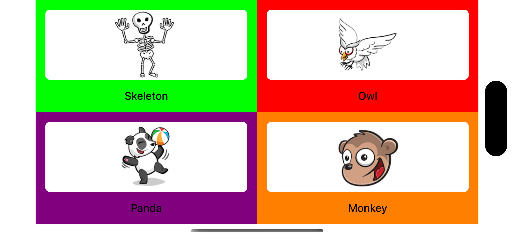
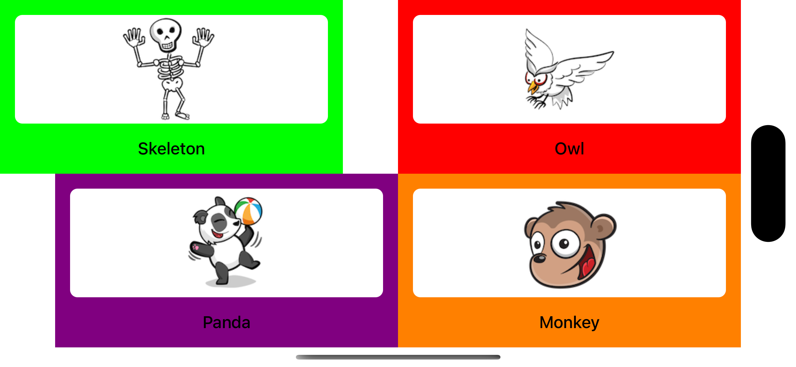

## Auto Layout練習


###


**重點１.使用multiplier來設定約束**

使用bounds.width/height方式設定約束，如下：

```swift=
let viewFrame = view.bounds
cardView2.widthAnchor.constraint(equalToConstant: viewFrame.width / 2)
cardView2.heightAnchor.constraint(equalToConstant: viewFrame.height / 2)
```
執行結果(手機轉向橫向時會有bug):


採用multiplier方式
```swift=
let viewFrame = view.bounds
cardView2.widthAnchor.constraint(equalTo: safeArea.widthAnchor, multiplier: 0.5),
      cardView2.heightAnchor.constraint(equalTo: safeArea.heightAnchor, multiplier: 0.5),
```



**重點2.在ViewController內使用safeAreaLayoutGuide來設定約束**

在viewController使用view時如果用view.leadingAnchor
```swift
cardView1.leadingAnchor.constraint(equalTo: view.leadingAnchor)
```

執行結果(在旋轉手機時會有bug):


在自訂的UIView內可以用view.leadingAnchor，但是在ViewController使用view時應使用view.safeAreaLayoutGuide

```swift
cardView1.leadingAnchor.constraint(equalTo: view.safeAreaLayoutGuide.leadingAnchor),
```


## Reference

- [Building an App With Only Code Using Auto Layout](https://www.kodeco.com/6004856-building-an-app-with-only-code-using-auto-layout)

